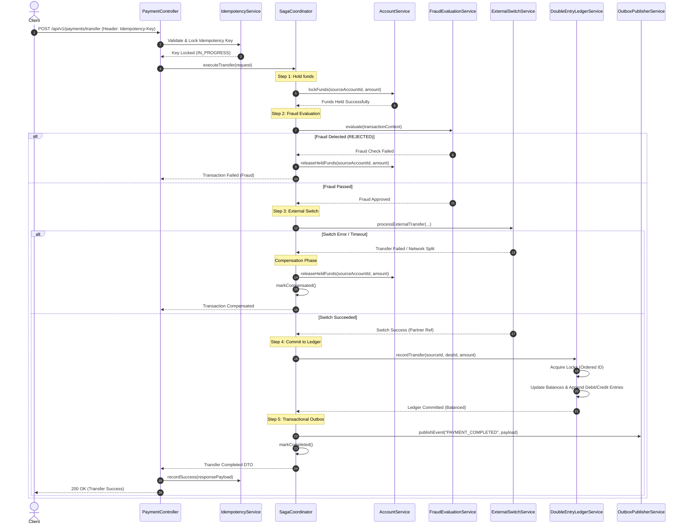

# AegisLedger - Kiến Trúc Hệ Thống Tổng Thể (System Architecture)

## 1. Triết Lý Thiết Kế & Mục Tiêu Kỹ Thuật

AegisLedger được thiết kế cho hệ thống thanh toán và ngân hàng lõi (Core Banking & Payment Orchestrator) với 3 mục tiêu bất khả xâm phạm:
1. **Zero Data Inconsistency (Bảo toàn số dư 100%)**:
   - Sử dụng mô hình **Double-Entry Bookkeeping (Kế toán kép)** bất biến (Append-only ledger entries).
   - Mọi giao dịch chuyển tiền luôn sinh ra tối thiểu một cặp bản ghi (DEBIT và CREDIT) cân bằng tuyệt đối:
     $$\sum \text{Debit} = \sum \text{Credit}$$
2. **Zero Race Conditions (Kiểm soát đồng thời tuyệt đối)**:
   - Áp dụng **Pessimistic Locking** (`SELECT ... FOR UPDATE` trong JPA qua `@Lock(LockModeType.PESSIMISTIC_WRITE)`) khi thay đổi số dư tài khoản.
   - Sắp xếp thứ tự khóa tài khoản theo thứ tự định danh (Account ID ordering) để triệt tiêu hoàn toàn **Deadlock**.
3. **Resilient Distributed Transactions (Saga Orchestration & Outbox)**:
   - Điều phối giao dịch phân tán qua **Saga Pattern** gồm 4 bước: Phong tỏa (Hold) $\to$ Đánh giá rủi ro (Fraud Check) $\to$ Chuyển mạch thanh toán đối tác (External Switch) $\to$ Commit sổ cái / Bồi hoàn (Compensate).
   - Tích hợp **Transactional Outbox Pattern** đảm bảo tính nguyên tử (Atomicity) khi đồng bộ dữ liệu giữa PostgreSQL và Kafka/Event Bus.

---

## 2. Sơ Đồ Kiến Trúc Phân Tầng

```text
+-------------------------------------------------------------------------+
|                                CLIENTS                                  |
|         Web Apps / React Dashboard / Third-Party Payment Partners       |
+-------------------------------------------------------------------------+
                                    │  REST Request (with Idempotency-Key)
                                    ▼
+-------------------------------------------------------------------------+
|                        TIER 3: WEB & IDEMPOTENCY                        |
|  [ Idempotency Filter ] ──► Chặn request trùng lặp & Double-charge      |
|  [ AccountController ]   [ PaymentController ]   [ LedgerController ]   |
+-------------------------------------------------------------------------+
                                    │
                                    ▼
+-------------------------------------------------------------------------+
|                    TIER 2: SAGA & ORCHESTRATION LAYER                   |
|                                                                         |
|  +-----------------------------+       +-----------------------------+  |
|  |    PAYMENT ORCHESTRATOR     |       |     DOUBLE-ENTRY LEDGER     |  |
|  |  - SagaCoordinator          |       |  - Immutable Bookkeeper     |  |
|  |  - State Manager            |──────►|  - Lock Coordinator         |  |
|  |  - Compensator Service      |       |  - Audit Snapshotting       |  |
|  +-----------------------------+       +-----------------------------+  |
|                 │                                     │                 |
+─────────────────┼─────────────────────────────────────┼─────────────────+
                  │                                     │
                  ▼                                     ▼
+-------------------------------------------------------------------------+
|                    TIER 1: INDEPENDENT DOMAINS                          |
|                                                                         |
|  +-----------------------------+       +-----------------------------+  |
|  |       ACCOUNT DOMAIN        |       |        FRAUD ENGINE         |  |
|  |  - Account Entity & Repo    |       |  - Sliding Window Counter   |  |
|  |  - Hold / Release Balance   |       |  - Velocity & Anomaly Rules |  |
|  |  - Pessimistic Locking      |       |  - Dynamic Risk Scoring     |  |
|  +-----------------------------+       +-----------------------------+  |
+-------------------------------------------------------------------------+
                                    │
                                    ▼
+-------------------------------------------------------------------------+
|                       TIER 0: SHARED CORE & UTILS                       |
|  Money Value Object (BigDecimal, 4 Decimals) • Global Exception Handler  |
|  ApiResponse Standards • Virtual Threads Config (Loom) • BaseEntity     |
+-------------------------------------------------------------------------+
                                    │
                                    ▼
+-------------------------------------------------------------------------+
|                    TIER 3: WORKERS & INFRASTRUCTURE                     |
|  Transactional Outbox Worker (Virtual Threads) • Kafka • PostgreSQL 16   |
+-------------------------------------------------------------------------+
```

---

## 3. Quy Trình Điều Phối Giao Dịch (Saga Workflow)



---

## 4. Cơ Chế Chống Race Condition & Deadlock

1. **Deadlock Prevention**:
   Khi chuyển tiền giữa 2 tài khoản $A$ và $B$, nếu đồng thời có luồng $A \to B$ và luồng $B \to A$:
   - Hệ thống luôn sắp xếp khóa theo `account_id`:
     $$\text{firstLock} = \min(id_A, id_B), \quad \text{secondLock} = \max(id_A, id_B)$$
   - Điều này đảm bảo tất cả các luồng tranh chấp luôn xin khóa theo cùng một trật tự, triệt tiêu chu trình khóa (Circular Wait) của Deadlock.
2. **Double-Spending Prevention**:
   - Sử dụng `@Lock(LockModeType.PESSIMISTIC_WRITE)` trên `AccountRepository.findByIdForUpdate`.
   - Cơ sở dữ liệu phát hành khóa độc quyền (`FOR UPDATE`) lên hàng tài khoản nguồn và đích, ngăn chặn bất kỳ giao dịch song song nào đọc số dư cũ.
